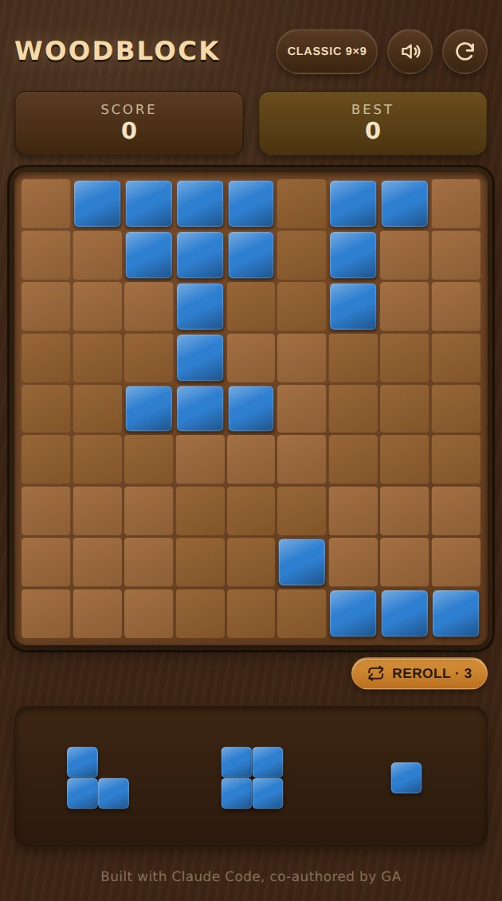

# 🧩 Woodblock

A wood-block puzzle game — drag polyomino pieces onto a grid and clear full rows and columns before the board fills up. Same family as *1010!* and *Block Blast* (no falling, no rotation), with a warm wood-and-tile aesthetic.

[](https://gilangagustian.github.io/woodblock/)
[](https://github.com/gilangagustian/woodblock/actions/workflows/deploy-pages.yml)

**[gilangagustian.github.io/woodblock](https://gilangagustian.github.io/woodblock/)**



## Features

- **9×9 board** with 3 difficulty variants — Easy (7×7), Classic (9×9), Hard (11×11)
- **36 piece shapes**, from a single square up to full pentominoes, weighted toward smaller/easier-to-place pieces so hands don't skew too big
- **New games start pre-filled** with a light scatter of pieces instead of a bare board — the starting hand is always guaranteed to have somewhere to go, and so is every hand dealt afterward
- **3 rerolls per game** to swap out a bad hand
- **Combo streaks** — clearing lines on consecutive placements builds a scoring streak, on top of the usual multi-line clear bonus
- **Sound & haptics** — synthesized Web Audio effects and vibration feedback, no audio files bundled, with a mute toggle
- **Persistent best score** per difficulty, saved in `localStorage`
- **Installable PWA** — add it to your phone's home screen (custom icon, splash screens, offline-capable via a service worker)
- **Smooth pointer-based drag and drop** — no drag-and-drop library, hand-rolled with the Pointer Events API and `requestAnimationFrame`-friendly GPU-composited dragging

## How to play

1. Drag a piece from the tray onto the board. A green/red preview shows whether the current position is valid.
2. Release to place it — any row or column that's completely full clears immediately.
3. Clear multiple lines in one move, or clear lines on back-to-back placements, for bonus score.
4. When all 3 tray pieces are used, three new ones are dealt.
5. The game ends when none of the current pieces can be placed anywhere on the board.

## Tech stack

- [React](https://react.dev/) (functional components + hooks) and [Vite](https://vitejs.dev/)
- Plain CSS — no UI framework
- Web Audio API + Vibration API for feedback, `localStorage` for persistence
- Deployed to GitHub Pages via GitHub Actions (see [`.github/workflows/deploy-pages.yml`](.github/workflows/deploy-pages.yml))

## Getting started

Requires Node.js 18+.

```bash
git clone https://github.com/gilangagustian/woodblock.git
cd woodblock
npm install
npm run dev
```

Other scripts:

```bash
npm run build     # production build to dist/
npm run preview   # serve the production build locally
```

## Project structure

```
src/
  App.jsx              top-level state, drag-and-drop, screen flow
  useGame.js            game reducer (board, score, streaks, rerolls)
  gameLogic.js           pure board/piece logic (placement, line clears, piece generation)
  shapes.js               polyomino shape + tile color definitions
  difficulty.js            difficulty/grid-size config
  storage.js                localStorage helpers (best score, sound preference)
  feedback.js                synthesized sound + haptics
  components/                 Board, PieceTray, ScoreBar, modals, menus
public/
  manifest.webmanifest    PWA manifest
  icons/, splash/           generated app icons and iOS splash screens
  sw.js                       service worker
```

## Deployment

Pushing to this repo's default branch triggers the GitHub Actions workflow in [`.github/workflows/deploy-pages.yml`](.github/workflows/deploy-pages.yml), which builds the app and publishes `dist/` to GitHub Pages.

---

Built with [Claude Code](https://claude.ai/code), co-authored by GA.
